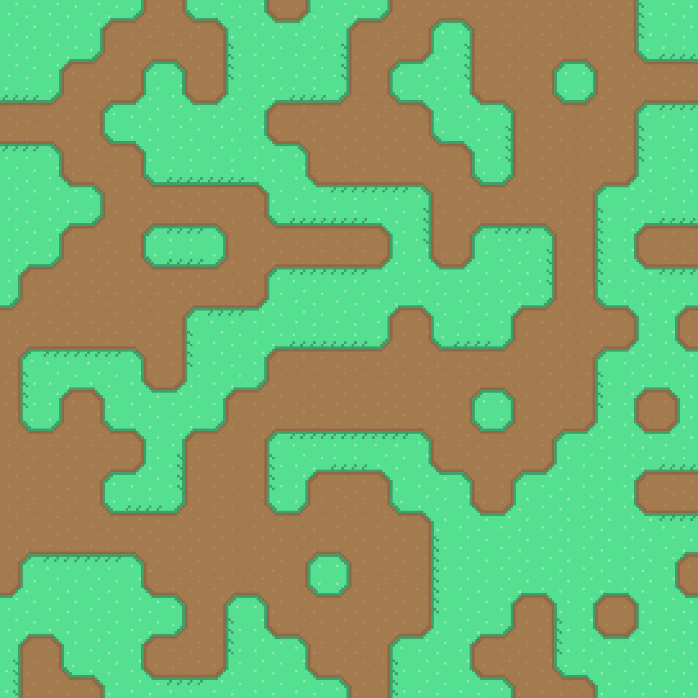

# Wave function collapse

WFC tile solver, visualized on a 2D canvas in JavaScript.

## Run it locally

Serve the root folder using the local server of your choice.  
If you've got Python installed, you can run `python3 -m http.server 8000` and then navigate to http://localhost:8080.

## TO-DO

- Neighbor cells must look ahead and influence _their_ neighbors' entropies as well. Right now it can fail near the end because the algorithm only influences immediate neighbors of a cell.
